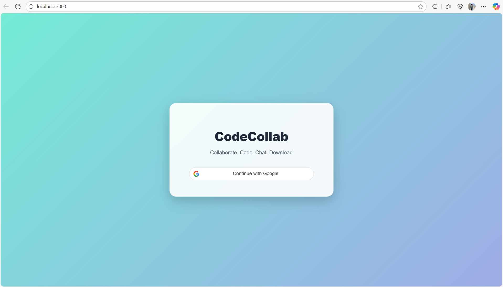
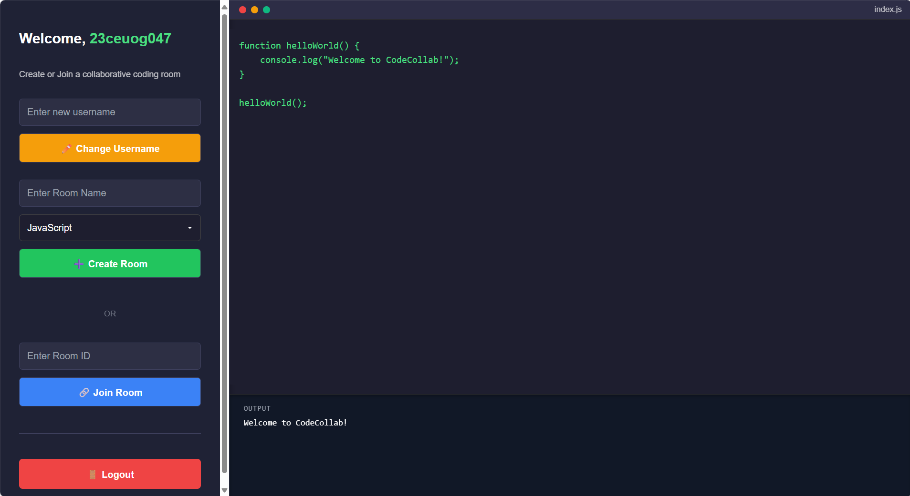
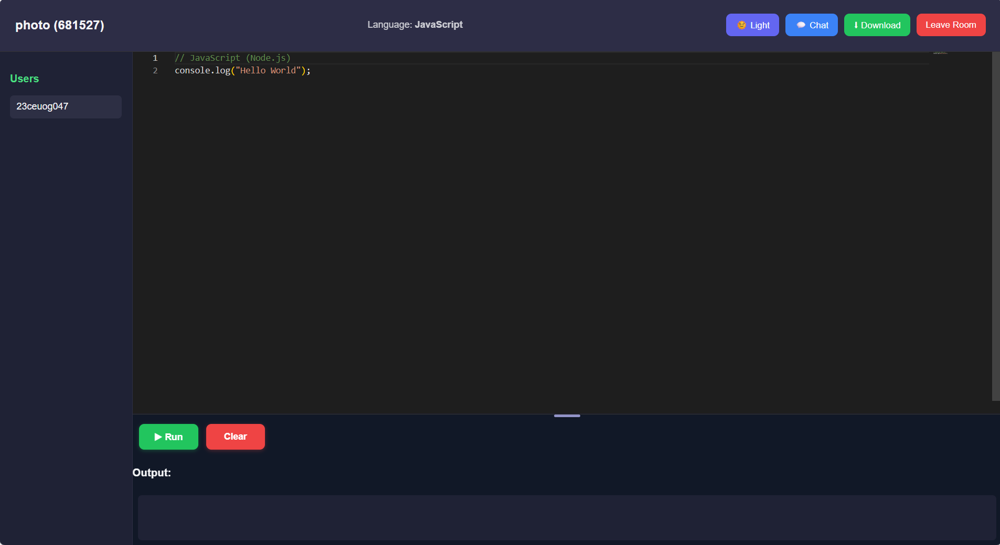

# 🖥️ Real-Time Collaborative Coding App


👨‍💻 **Welcome, Code Wizard!**  
Collaborate in real-time, create rooms, and code together with friends or colleagues. Perfect for **pair programming**, **coding interviews**, and **study groups**.  

---

## 🚀 Features

- 🔐 **Google Authentication** — Users sign in/up using Google ID  
- 🆔 **Username System** — Default username is email prefix; can be changed later  
- 🏠 **Room Management** — Create or join rooms with a **6-digit Room ID**  
- ⚡ **Real-Time Collaboration** — Instant code sync across all participants using **Socket.IO**  
- 💬 **Chat Option** — Built-in real-time chat for each room  
- 🗑️ **Auto Cleanup** — Rooms inactive for **7 days** are automatically deleted  
- ⏳ **Session Expiry** — Users are auto-logged out after **1 hour**  
- 📄 **Download Code** — Export code files (`.cpp`, `.c`, `.js` etc.)  
- 🌙 **Dark/Light Mode** toggle for personalized UI  
- 📝 **Code Editor** — Integrated **Monaco Editor** with syntax highlighting  

---

## 📂 Project Structure

```bash
collab-coding-app/
│
├── backend/                            # Backend (Node.js + Express + MongoDB + Socket.IO)
│   ├── middleware/
│   │   └── auth.js                     # JWT or session authentication middleware
│   │
│   ├── models/
│   │   ├── Room.js
│   │   └── User.js
│   │
│   ├── routes/
│   │   ├── authRoutes.js               # Handles login/register
│   │   ├── roomRoutes.js               # Handles room creation/joining
│   │   └── executeRoutes.js            # Code execution (optional)
│   │
│   ├── db.js                           # MongoDB connection
│   ├── server.js                       # Express + Socket.IO main entry point
│   ├── test-socket.js                  # (Optional) for socket testing
│   ├── .env                            # Environment variables (PORT, MONGO_URI, JWT_SECRET, etc.)
│   ├── .gitignore
│   ├── package.json
│   └── package-lock.json
│
├── frontend/                           # Frontend (React + Socket.IO client)
│   ├── public/
│   │   ├── index.html
│   │   └── logo.png
│   │
│   ├── src/
│   │   ├── pages/                      # Full-page components
│   │   │   ├── HomePage.js
│   │   │   ├── HomePage.css
│   │   │   ├── LoginPage.js
│   │   │   ├── LoginPage.css
│   │   │   ├── RoomPage.js
│   │   │   └── RoomPage.css
│   │   │
│   │   ├── styles/                     # Global and modular styles
│   │   │   ├── global.css
│   │   │   ├── index.css
│   │   │
│   │   ├── screenshots/                # App screenshots
│   │   │   ├── login.png
│   │   │   ├── home.png
│   │   │   └── room.png
│   │   │
│   │   ├── App.js                      # Main app component (React Router)
│   │   └── index.js                    # React entry point
│   │
│   ├── .env
│   ├── .gitignore
│   ├── package.json
│   └── package-lock.json
│
└── README.md

```

---

## ⚙️ Installation

### 1. Clone the Repository
```bash
git clone https://github.com/kalpeshgangani16/Collaborative-CodeEditor.git
cd Collaborative-CodeEditor
```

### 2. Frontend Setup
```bash
cd src
npm install
npm start
```

👉 Open in browser: [http://localhost:3000](http://localhost:3000)

### 3. Backend Setup
```bash
cd backend
npm install
```

Create a `.env` file in **backend/**:
```env
PORT=5000
MONGO_URI=your_mongo_connection_string
JWT_SECRET=your_secret_key
GOOGLE_CLIENT_ID=your_google_client_id
```

Start the backend:
```bash
npm run dev
```

---

## 📝 Usage

1. **Login with Google**  
   - First time → username = email prefix  
   - User can later update their username  

2. **Create a Room**  
   - Enter room name → Generates a **6-digit Room ID**  
   - If a room with the same name exists → error shown  

3. **Join a Room**  
   - Enter the **6-digit Room ID** to join  
   - Multiple users can join the same room  

4. **Code Together**  
   - Real-time code sync for all users  
   - Export/download code in `.cpp`, `.c`, or `.js`  

5. **Chat Inside Room**  
   - Send messages while coding  

6. **Automatic Cleanup**  
   - Inactive rooms (>7 days) are deleted  

7. **Session Expiry**  
   - Users auto-logged out after **1 hour**  

---

## 🎨 Frontend Highlights

- ⚛️ Built with **React**  
- 📝 **Monaco Editor** for collaborative coding  
- 🌙 Dark/Light mode toggle  
- 📱 Fully responsive design  
- 🎨 CSS Modules for scoped styling  

---

## 🛠️ Backend Highlights

- ⚡ **Node.js + Express.js** + **Socket.IO** for real-time sync  
- 🗄️ **MongoDB** for persistent storage  
- 🔑 **JWT Authentication** with session timeout  
- ♻️ Automatic **inactive room cleanup**  
- REST APIs for auth & room handling  

---

## 🛠️ Future Improvements

- 👥 Show list of online users inside a room  
- 🌍 Add support for more programming languages  
- 💾 Save multiple file versions per room  
- ▶️ Live code execution inside editor  
- 📊 Dashboard for recent activity  

---

## 💻 Screenshots

### 🔐 Login Page


### 🏠 Home Page


### 📝 Room Page



---

## 📜 License

MIT License © 2025 — Developed by **Kalpesh**
